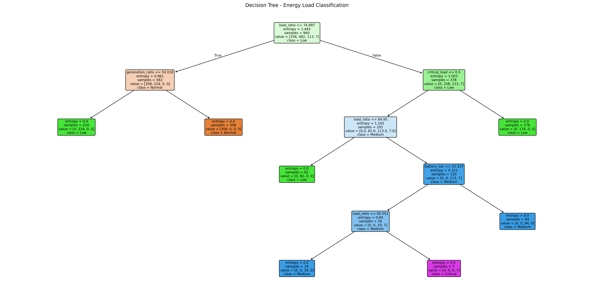
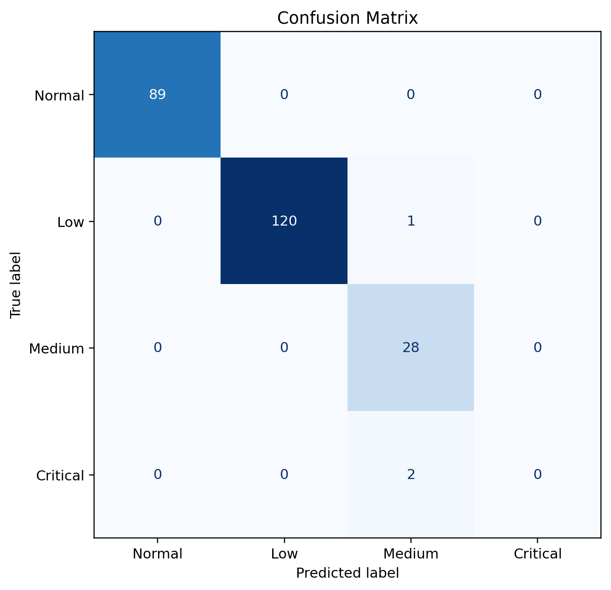
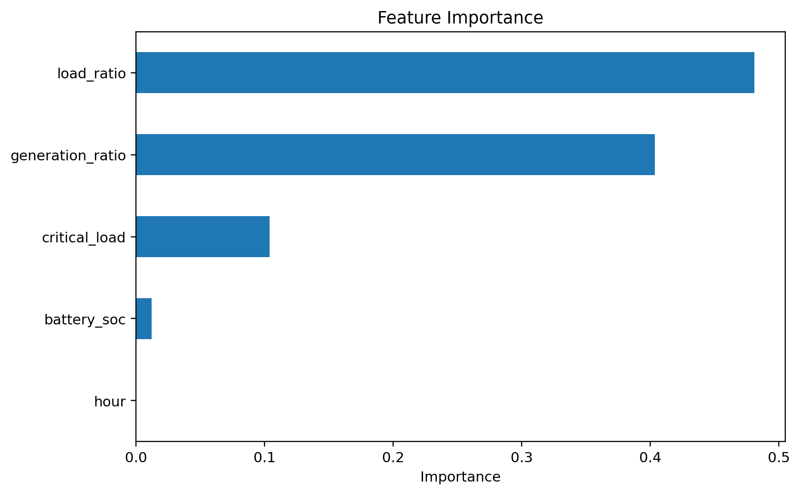

# Decision Tree Classification – Energy Load Analysis

Python ve Scikit-learn kullanılarak enerji yük durumlarının Decision Tree tabanlı sınıflandırılması.

## Amaç

Enerji yük oranı, üretim seviyesi, batarya doluluk oranı, kritik yük bilgisi ve saat verilerini kullanarak yük durumunu sınıflandıran bir karar ağacı modeli geliştirmek.

## Teknolojiler

- Python
- Pandas
- NumPy
- Scikit-learn
- Matplotlib
- Joblib
- Streamlit

## Veri

Proje, tekrar üretilebilir bir sentetik enerji veri seti kullanır.

## Model

- Decision Tree Classifier
- Criterion: Entropy
- Max depth: 5

## Model Performansı

Test accuracy: **98.75%**

```text
              precision    recall  f1-score   support

      Normal       1.00      1.00      1.00        89
         Low       1.00      0.99      1.00       121
      Medium       0.90      1.00      0.95        28
    Critical       0.00      0.00      0.00         2

    accuracy                           0.99       240
   macro avg       0.73      0.75      0.74       240
weighted avg       0.98      0.99      0.98       240

```

## Görseller

### Decision Tree


### Confusion Matrix


### Feature Importance


## Çalıştırma

```bash
pip install -r requirements.txt
python main.py
```

Streamlit arayüzü:

```bash
streamlit run app.py
```

## Not

Bu repository, açık kaynak bir akıllı şebeke/Decision Tree projesindeki genel teknik yaklaşım incelenerek bağımsız bir eğitim/prototip çalışması olarak hazırlanmıştır.
